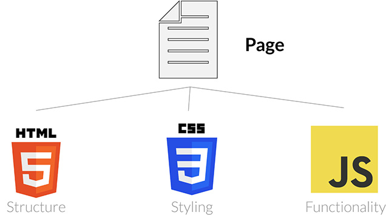

# Lesson 01 - File Management - HTML, CSS, and JavaScript

## Overview

This lesson introduces how websites are organized using separate files for HTML, CSS, and JavaScript. Students will learn what each file type does and how they work together to build a complete webpage.

## The Role of HTML in Websites

HTML (HyperText Markup Language) is responsible for the structure and content of a webpage, such as text, images, and layout elements. It acts as the foundation of a website, defining what appears on the page.

## The Role of CSS in Websites

CSS (Cascading Style Sheets) controls the visual appearance of a website, including colors, fonts, spacing, and layout design. It allows developers to make webpages look polished and visually consistent without changing the HTML structure.

## The Role of JavaScript in Websites

JavaScript adds interactivity and dynamic behavior to a website, such as responding to user actions, updating content, and creating animations. It transforms a static webpage into an interactive experience.
