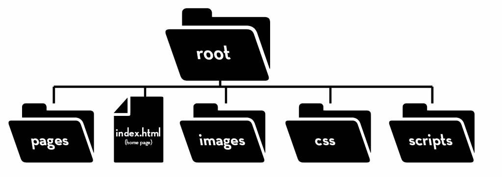

# Lesson 02 - File Management - Setting Up Projects

## Overview

This lesson explains how to properly set up and organize a web development project using folders and files. Students will learn both how to structure their projects and why good organization is essential for building and maintaining websites.



## Creating a `Root` Folder

The root folder is the main project folder that contains all files and subfolders for a website, and it should be created before writing any code. This keeps everything in one place, making it easier to manage files, avoid confusion, and ensure the website works correctly when opened or shared.

The pattern that we follow for this course will always have the following in the root folder **even if they aren't used as a part of your website**:

* `index.html`
* `pages/`
* `images/`
* `css/`
* `scripts/`

*Note: the little `/` at the end of a name means it's a folder.* 

This is a visual example of what your root folder should look like by the end:
```
root/
├── index.html
├── pages/
├── images/
├── css/
│   └── styles.css
└── scripts/
    └── script.js
```

## `index.html`

The `index.html` file is the main entry point of a website and should always be placed in the root folder. Browsers automatically look for this file first, which is why it acts as the homepage and connects to other files like CSS and JavaScript.

## Organizing Project Contents

Project contents should be organized into clearly named folders such as `css`, `scripts`, and `images` to separate different types of files. This improves readability, makes debugging easier, and helps developers quickly locate and manage files as projects grow in size and complexity.

## Relative Paths

Relative paths are used to link files (like CSS or JavaScript) based on their location inside the project folder rather than using full system paths. This is important because it keeps projects portable—meaning they will still work if moved to another computer or uploaded to a server—since all file connections are based on the folder structure.

Here are **clear, beginner-friendly examples of relative paths**, including both *how to write them* and *why they work*.

### Key Rules

* `folder/file` → go **into a folder**
* `../` → go **up one level**
* `../../` → go **up two levels**
* Paths are always based on **where the current file is**


### Basic Project Structure Example

Imagine your project looks like this:

```
my_website/
│
├── index.html
├── css/
│   └── styles.css
├── scripts/
│   └── script.js
└── images/
    └── logo.png
```


### Example 1: Linking CSS from `index.html`

**How:**

```html
<link rel="stylesheet" href="css/styles.css">
```

**Why:**

* `index.html` is in the root folder
* The `css` folder is inside the root
* So we go **into the folder** → `css/styles.css`


### Example 2: Linking JavaScript from `index.html`

**How:**

```html
<script src="scripts/script.js"></script>
```

**Why:**

* Same idea as CSS
* We move **from root → into the `js` folder**
* Then access the file


### Example 3: Displaying an Image

**How:**

```html

```

**Why:**

* The image is inside the `images` folder
* So we navigate directly into that folder

### Example 4: Going *Up* a Folder (`..`)

Now imagine this structure:

```
my_website/
│
├── index.html
├── pages/
│   └── about.html
└── css/
    └── styles.css
```

#### From `about.html` to CSS:

**How:**

```html
<link rel="stylesheet" href="../css/styles.css">
```

**Why:**

* `about.html` is inside `pages`
* `..` means **go up one folder (back to root)**
* Then go into `css`

Path breakdown:

```
pages → .. (back to root) → css → styles.css
```

### Example 5: Going Up Multiple Levels

```
my_website/
│
├── index.html
├── pages/
│   └── team/
│       └── members.html
└── images/
    └── photo.png
```

#### From `members.html` to image:

**How:**

```html

```

**Why:**

* `members.html` is inside `team`, which is inside `pages`
* So:

    * `..` → goes to `pages`
    * `..` → goes to root
* Then go into `images`


