# Lesson 03 - HTML - Basic Tags

## Overview

This lesson introduces the core HTML tags used to structure and display content on a webpage. Students will learn what each tag does and how it contributes to building a functional web page.

## What is an HTML Tag?

An HTML tag is a piece of code used to define elements on a webpage, such as text, images, or structure. Tags tell the browser how to display and organize content.

* Most tags have an **opening tag** and a **closing tag**
* The opening tag starts the element, and the closing tag ends it
* Closing tags include a `/` (e.g., `</p>`)
* Content is placed between the opening and closing tags

```html
<p>This is a paragraph</p>
```

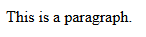

* Tags can be **nested inside one another**
* This means one tag can be placed inside another to create structure

```html
<body>
    <h1>This is a heading inside a body.</h1>
    <p>This is a paragraph inside a body.</p>
</body>
```

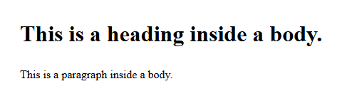

* Nested tags must be **properly closed in the correct order**

```html
<!-- Correct -->
<p><strong>Bold text</strong></p>

<!-- Incorrect: p closed before strong -->
<p><strong>Bold text</p></strong>
```

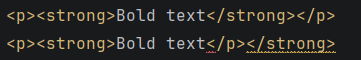

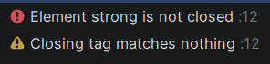

---

## How To Build A Basic HTML Document

*Before starting, use the `Challenge 01 - My First HTML Page` folder to create a root folder structure identical to the root folder below:*

```
Challenge 01 - My First HTML Page/
├── index.html
├── pages/
├── images/
├── css/
│   └── styles.css
└── scripts/
    └── script.js
```

---

### 1. Open `index.html`

When you open up a new HTML document, WebStorm adds some tags by default to help you get started.

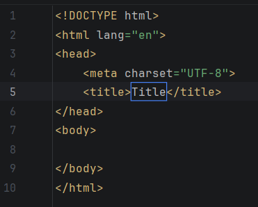

In the HTML document, all of our content will go in the `<body>` tags. An HTML document only ever has **one body tag**.

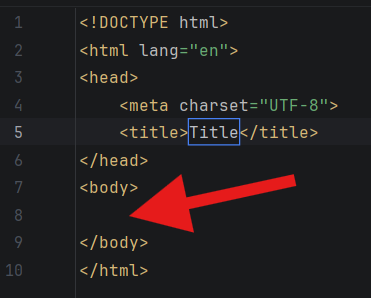

We can also make changes to our metadata in the `<head>` tags.

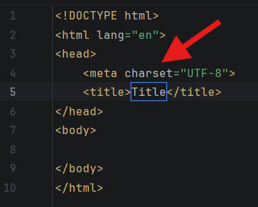

As you become more familiar with web development, you might add more to your `<head>` tag, but we will cover that later in this course.

---

### 2. Open the Preview

Once you have an HTML document, you can preview it in any modern web browser. This can be done in a few ways.

#### Run Button

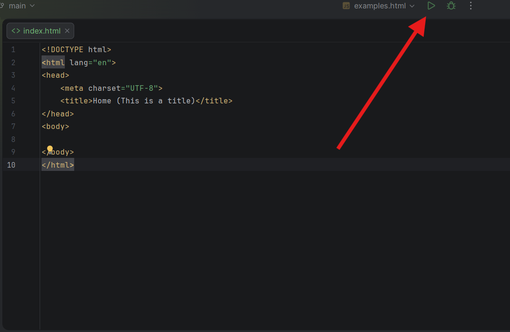

#### Browser Select

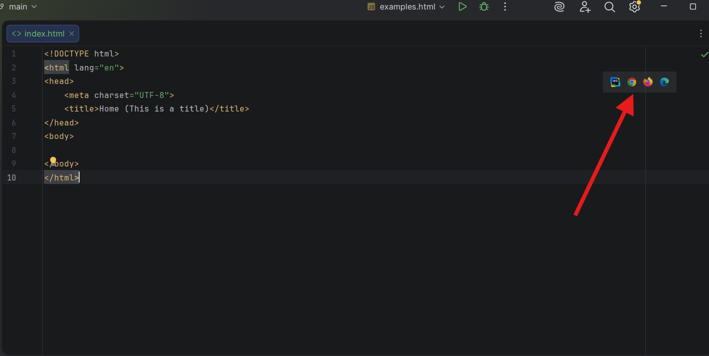

---

### 3. Change Document Meta Data
The first change we make to our web page is updating some metadata. 

At this point, the only change we make is to the `<title>` tag. Your title should reflect the purpose of the web page. It can have spaces in the text. It does not need to match the name of the file. 

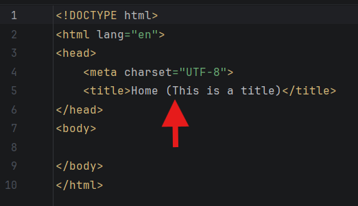

The title is what shows up on the tab of a web page you are visiting. You should see this once you change your `<tiltle>` tag!

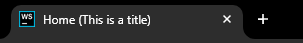

---

### 4. Add Text Content

Inside the body, add some of the following text content tags. Copy and paste these tags into your body and change their text! Check your preview to see what it looks like!

*Details for each of these tags can be found in `_Help > HTML Tag Reference.md` or in `_Help > Useful Resources.md`.*

```html
<h1>This is a Heading!</h1>
```

```html
<h1>There are 6 levels of headings!</h1>
<h2>There are 6 levels of headings!</h2>
<h3>There are 6 levels of headings!</h3>
<h4>There are 6 levels of headings!</h4>
<h5>There are 6 levels of headings!</h5>
<h6>There are 6 levels of headings!</h6>
```

```html
<p>This is a paragraph!</p>
```

---

### 5. Add Images

When adding images, there are 2 ways to display them. They can either be hosted locally (you have the image saved to your computer) or they can be linked to through the internet (using another image that exists on the internet on your web page).

#### Local Images

1. Find and download an image from the internet.
2. Save the image into your `images` folder inside your root folder.
3. Make sure the image name meets the following requirements:
   * The name is all lowercase (no capital letters).
   * The name has no spaces.
4. Create an `` tag.
   * *Note: `` tags are special and do not require a closing tag!*
5. Add a `src` attribute inside the tag. The syntax for adding a `src` attribute will look like this:

```html

```

6. Images also require an `alt` attribute. The `alt` attribute displays text when the image does not load properly. It also reads text out for devices that have a screen reader enabled. 

* If the image adds any meaning to the web page, add a single sentence description to the image. 

```html

```

* If the image is purely decorative (no additional meaning for the web page) include an alt tag with empty quotes.

```html

```

#### Images From the Internet

1. Find an image from the internet, and copy the image address (not the link address or the image itself). 

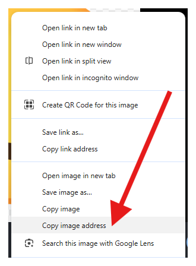

2. Create an `` tag.
    * *Note: `` tags are special and do not require a closing tag!*
3. Add a `src` attribute inside the tag. The syntax for adding a `src` attribute will look like this:

```html

```

4. Images also require an `alt` attribute. The `alt` attribute displays text when the image does not load properly. It also reads text out for devices that have a screen reader enabled.

* If the image adds any meaning to the web page, add a single sentence description to the image.

```html

```

* If the image is purely decorative (no additional meaning for the web page) include an alt tag with empty quotes.

```html

```


### 6. Add Links

The "HT" in "HTML" stands for "Hyper-Text", which is how web pages are connected. Links are used to connect web pages across the internet to one another. 

Links use an "anchor" tag (`<a>`) and use the `href` attribute to connect to other pages. To link to a local web page, you just need to connect the relative path.

*For a reminder on how relative paths work, see `Lesson 02 - File Management - Setting Up Projects.md`.*

Let's add a link to the Google home page. To change the web address, just change the value for the `href` attribute.


The text between the opening and closing tag will display as the text.

```html
<a href="https://www.google.com/">Link Text Goes Here!</a>
```


You can also use an image as a link. Anything you put inside an anchor tag will be used as the hyperlink!

```html
<a href="https://www.google.com/"></a>
```


---

Congratulations! You just created your first HTML page!

---

## Examples

Below is a list of examples for basic web pages.

### Example - Minimum Viable Web Page

This is the simplest complete HTML page with visible content, showing a heading and a paragraph.

```html
<!DOCTYPE html>
<html>
<head>
    <title>Hello World Page</title>
</head>

<body>
    <h1>Hello World</h1>
    <p>I love computer science</p>
</body>
</html>
```

---

### Example - Simple Page with Headings and Paragraphs

This example shows basic text structure using headings and paragraphs.

```html
<!DOCTYPE html>
<html>
<head>
    <title>About Me</title>
</head>

<body>
    <h1>About Me</h1>
    <h2>Introduction</h2>
    <p>Hello! My name is Nathan.</p>

    <h2>Hobbies</h2>
    <p>I enjoy coding and playing video games.</p>
</body>
</html>
```

---

### Example - Page with an Unordered List

This example shows how to group related items using a bulleted list.

```html
<!DOCTYPE html>
<html>
<head>
    <title>My Favorite Foods</title>
</head>

<body>
    <h1>Favorite Foods</h1>
    <p>Here are some foods I like:</p>

    <ul>
        <li>Pizza</li>
        <li>Burgers</li>
        <li>Pasta</li>
    </ul>
</body>
</html>
```

---

### Example - Page with an Ordered List and Image

This example combines a numbered list with an image.

```html
<!DOCTYPE html>
<html>
<head>
    <title>Steps to Learn Coding</title>
</head>

<body>
    <h1>How to Start Coding</h1>

    <ol>
        <li>Learn basic HTML</li>
        <li>Practice every day</li>
        <li>Build small projects</li>
    </ol>

    <p>Here is a coding image:</p>
    
</body>
</html>
```

