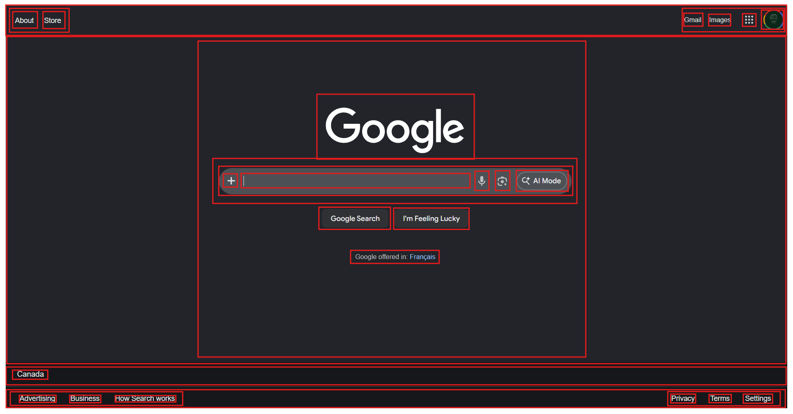
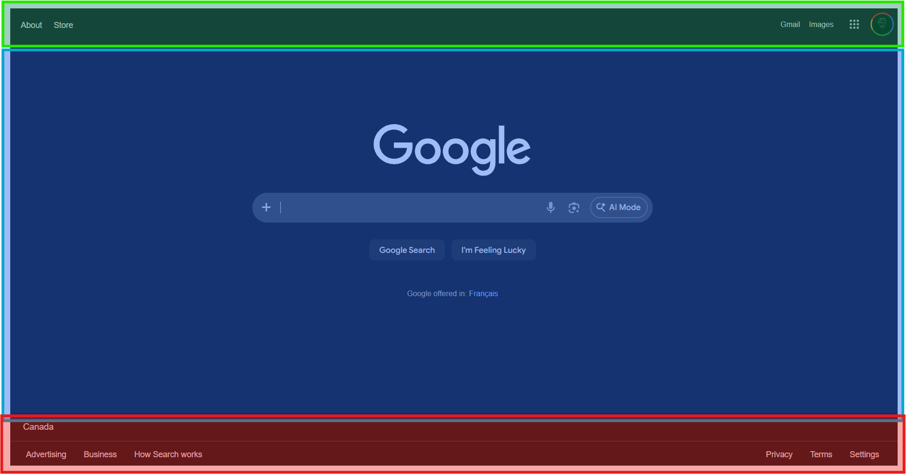
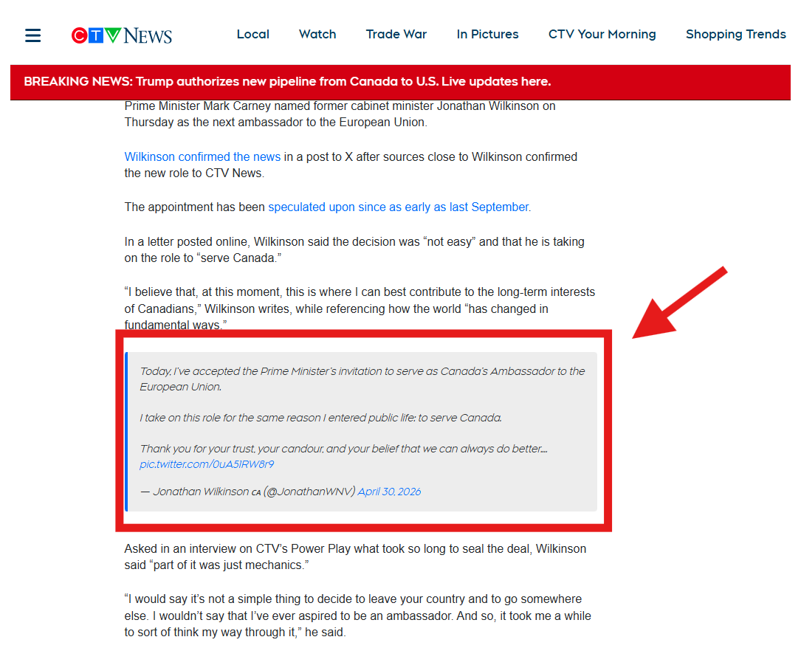
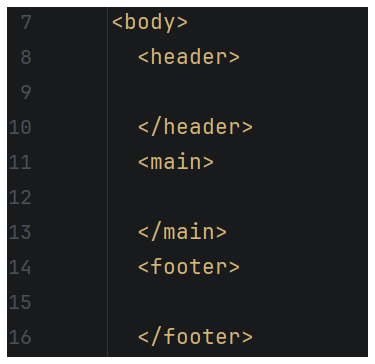
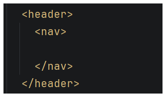
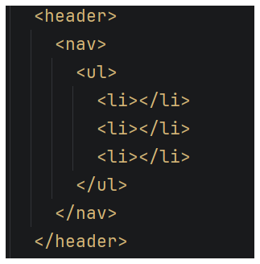
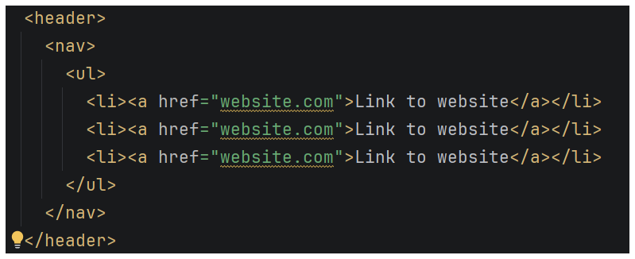
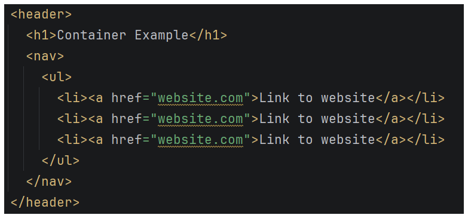

# Lesson 04 - HTML - Container Tags

## Overview

This lesson introduces container tags used to organize and group content on a webpage. Students will learn how to structure pages using meaningful semantic elements and flexible general-purpose containers. To build an effective website, most things will be nested inside of containers.

Consider the example below where each of these red boxes represents a container! Even a webpage as simple as the Google home page has many containers stacked inside other containers.



Later in this course, you will learn more complex techniques for creating layouts with CSS Grid and CSS Flexbox. To prepare for creating layouts, it is important to practice grouping related content together in containers.

## Typical Page Layout

A typical web page will include a header, main, and footer section. In the example below, the header section is **green**, the main section is **blue**, and the footer section is **red**.



To create these sections we can use *semantic tags* to group content together. Semantic means that a tag describes what it does in regular language. For example, a `<header>` tag is used to create a websites *header*:

*Note that these semantic are nested **inside** a body tag!*

```html
<body>
<header>

</header>
<main>

</main>
<footer>

</footer>
</body>
```

### `<header>` vs `<head>` vs `<h1>`

When talking about tags, we can sometimes get confused between "head", "header", and "headings" because they all sound very similar. However, these tags are all used for **very** different purposes.

| Head                                                                            | Header                                                                                                     | Heading                                                                                                    |
|---------------------------------------------------------------------------------|------------------------------------------------------------------------------------------------------------|------------------------------------------------------------------------------------------------------------|
| `<head>`<br>Used for a web pages meta data and must come before a `<body>` tag. | `<header>`<br>Used to organize web content that should be at the top of the webpage before a `<main>` tag. | `<h1>`-`<h6>`<br>Used to show text with different levels of importance, typically used for section titles. |

## Nesting

When we use containers, like `<header>`, `<main>`, or `<footer>`, other tags will get nested *inside* of them. To keep your code organized, it is **crucial** that tags are spaced and indented in a readable way.

Unlike Python, HTML does not care about indentation when it runs code. However, without clean indentation and spacing, it can become unclear what tags are nested inside of others.

Consider the three code examples below. All three examples will show the *exact same webpage*. Which one is the easiest to read? Which one is the hardest to read?

### Nesting Example 1

```html
<body><header><h1>Hello World!</h1></header><main><h2>Section 1 Title</h2><p>A bunch of information about section 1.</p><h2>Section 2 Title</h2><p>A bunch of information about section 2.</p></main><footer><p>This is where social media links would go.</p></footer></body>
```

### Nesting Example 2

```html
<body>
<header>
  <h1>Hello World!</h1>
</header>
<main>
  <h2>Section 1 Title</h2>
  <p>A bunch of information about section 1.</p>
  
  <h2>Section 2 Title</h2>
  <p>A bunch of information about section 2.</p>
  
</main>
<footer>
  <p>This is where social media links would go.</p>
</footer>
</body>
```

### Nesting Example 3

```html
<body>
<header>
  <h1>Hello World!</h1>
</header>
<main>
  <h2>Section 1 Title</h2>
  <p>A bunch of information about section 1.</p>
  
  <h2>Section 2 Title</h2>
  <p>A bunch of information about section 2.</p>
  
</main>
<footer>
  <p>This is where social media links would go.</p>
</footer>
</body>
```

## Generic Container Tags

Sometimes you will need to group content together. This could be for layout purposes, styles, or even just to help yourself stay organized. To group content together, it can be placed inside the amazing `<div>` tag.

The `<div>` is short for "division" and represents a smaller section of a webpage.

The `<div>` tag is the ***single most important tag in modern web development***. Divs can be used in place of any other container tag, can contain content, can remain empty, and can do almost anything you need.

If you ever get stuck with web layout or organization, the best first question to ask yourself is "Can I solve this problem with a div?"

### Putting Content Inside of a `<div>`

You might want to group content together inside a `<div>`. It might look something like this:

```html
<div>
    <h1>Logo Text</h1>
    
</div>
```


### Nesting Multiple `<div>` Tags

Sometimes, you might need to put a div inside of a div inside of a div. There is no limit to how many divs can be nested inside of each other.

```html
<div>
    <div>
        <div>
            <p>This is nested in one div.</p>
        </div>
    </div>
    <div>
        <p>This is nested inside of a different div.</p>
    </div>
</div>
```

### Why Should I Put Things Inside of `<div>` Tags?

Right now we haven't added any styling. Because of this, it might not make sense why we are adding divs. However, practicing grouping content together now will help prepare you to make the most out of CSS to effectively style a website.

## Other Semantic Tags

There are other kinds of tags that use meaning to convey what they contain as well! Sometimes content on a webpage should be grouped in one of these tags, and other times it will be okay to use a generic `<div>` tag.

### The `<section>` Tag

The `<section>` tag is like the `<div>` tag's cousin. It can be a useful way to break a web page down into distinct sections. For example, it might look something like this:

```html
<main>
    <section>
        <h2>Section 1</h2>
        <p>Text for section 1 goes here...</p>
    </section>
    <section>
        <h2>Section 2</h2>
        <p>Text for section 2 goes here...</p>
    </section>
    <section>
        <h2>Section 3</h2>
        <p>Text for section 3 goes here...</p>
    </section>
</main>
```

### Unordered and Ordered Lists

There is a special tag for both ordered and unordered lists.

#### Ordered Lists

An ordered list is a list that uses numbers because the elements of the list have a particular order.

`<ol>` is used as a container for ordered list items.

`<li>` is used as a container for list items. List items can contain text, images, headings, or any other content tag.

```html
<h1>How to Eat Cake</h1>
<ol>
    <li>Put cake on plate.</li>
    <li>Use fork to scoop cake into mouth.</li>
    <li>Chew cake.</li>
    <li>Swallow cake.</li>
    <li>Repeat steps 2-4 until satisfied.</li>
</ol>
```

#### Unordered Lists

An unordered list is a list that uses bullets because the elements of the list **do not** have a particular order.

`<ul>` is used as a container for ordered list items.

`<li>` is used as a container for list items. List items can contain text, images, headings, or any other content tag.

```html
<h1>Groceries</h1>
<ul>
    <li>Apples</li>
    <li>Milk</li>
    <li>Bread</li>
    <li>Eggs</li>
    <li>Cheese</li>
</ul>
```

### The `<nav>` Tag

The `<nav>` tag is a special container used for grouping links in a nav bar. A nav tag might look something like this:

```html
<header>
    <nav>
        <a href="index.html">Home</a>
        <a href="pages/shop.html">Shop</a>
        <a href="pages/about.html">About</a>
    </nav>
</header>
```

### The `<article>` Tag

An "article" is any group of web content that could exist as a standalone piece of content that could be shared without additional context. For example, social media post could be shared elsewhere without needing the context of being on social media.

In the image below, a post from X is shared on a CTV news article.



When you are creating a web page that might have a section shared to other websites, your article tag might look like this:

```html
<article>
    <h1>Post Title</h1>
    <p>Post content goes here...</p>
    <p>Post content goes here...</p>
    <p>Post content goes here...</p>
</article>
```

---

## How to Build a Web Page With Containers!

*Before starting, use the `Challenge 02 - Containers` folder to create a root folder structure identical to the root folder below:*

```
Challenge 02 - Containers/
├── index.html
├── pages/
├── images/
├── css/
│   └── styles.css
└── scripts/
    └── script.js
```

---

### 1. Update the title of your website

The title of this website should be something along the lines of "Container Practice", but you can name it whatever you want.

---

### 2. Set Up `<header>`, `<main>`, `<footer>` tags

In your `index.html` add a `header`, `main`, and `footer` tag to your body. Be sure to put them in the right order!



---

### 3. Add a `<nav>` to the Header

Inside your header add a `nav` tag for some navigation links.



---

### 4. Add an unordered list to the nav bar

Create an unordered list (`<ul>`) with at least 3 empty list item tags (`<li>`).



---

### 5. Add Anchor tags for links to your 3 favourite websites

Inside your `<li>` tags, be sure to include some actual links to websites. Remember that any `<a>` tag you use must include both an `href` attribute (the url to the website the link goes to) and text or an image between the tags.



---

### 6. Add a heading to your web page

Using `<h1>` add a heading to your website inside the header.



---

### 7. Add Divs with dummy text and placeholder images

When starting out with web development or when creating a web layout, it can be tedious to need to fill up content with actual text. For centuries, typists and developers alike have used lorem ipsum as dummy text as a placeholder. Here is a link to a [lorem ipsum generator](https://www.lipsum.com/). This link can also be found in `_Help > Useful Resources.md`

In your `<main>` tag, add 3 different divs that each contain:

* an `<h2>` heading
* 2 paragraphs
* an image
  * *For the image, the image must be locally downloaded and saved in your `images/` folder.*

---

### 8. In the footer add a small copyright paragraph

Often on websites you will see `©` with the name of the creator and year. Add a `<p>` tag that includes a `©` symbol. This can be done by either:

* Copying and pasting it from here or the internet.
* Pressing `Alt` + `0` `1` `6` `9` *(on your number pad)*

---

Congratulations! You just built a website with containers!

---

## Example - Basic Page Structure Nesting

This example shows how major sections of a webpage are nested inside semantic container tags.

```html
<!DOCTYPE html>
<html>
<head>
  <title>Basic Layout</title>
</head>

<body>
<header>
  <h1>My Website</h1>
</header>

<main>
  <section>
    <h2>Welcome</h2>
    <p>This is the main content.</p>
  </section>
</main>

<footer>
  <p>© 2026 My Website</p>
</footer>
</body>
</html>
```

---

## Example - Nested Sections and Articles

This example shows how sections can contain multiple articles.

```html
<!DOCTYPE html>
<html>
<head>
  <title>Articles</title>
</head>

<body>
<main>
  <section>
    <h2>News</h2>

    <article>
      <h3>Article One</h3>
      <p>This is the first article.</p>
    </article>

    <article>
      <h3>Article Two</h3>
      <p>This is the second article.</p>
    </article>
  </section>
</main>
</body>
</html>
```

---

## Example - Navigation Inside Header

This example shows nesting a navigation menu inside a header.

```html
<!DOCTYPE html>
<html>
<head>
  <title>Navigation Example</title>
</head>

<body>
<header>
  <h1>My Site</h1>

  <nav>
    <p>Home</p>
    <p>About</p>
    <p>Contact</p>
  </nav>
</header>

<main>
  <p>Welcome to the site!</p>
</main>
</body>
</html>
```

---

## Example - Using div and span for Grouping

This example shows how general-purpose containers can be nested within content.

```html
<!DOCTYPE html>
<html>
<head>
  <title>Div and Span</title>
</head>

<body>
<div>
  <h1>Profile</h1>
  <p>This is a <span>very important</span> message.</p>
</div>
</body>
</html>
```

---

## Example - Combining Lists Inside Sections

This example shows nesting lists inside structured content.

```html
<!DOCTYPE html>
<html>
<head>
  <title>My Tasks</title>
</head>

<body>
<main>
  <section>
    <h2>Today's Tasks</h2>

    <ol>
      <li>Finish homework</li>
      <li>Practice coding</li>
      <li>Go outside</li>
    </ol>
  </section>
</main>
</body>
</html>
```
