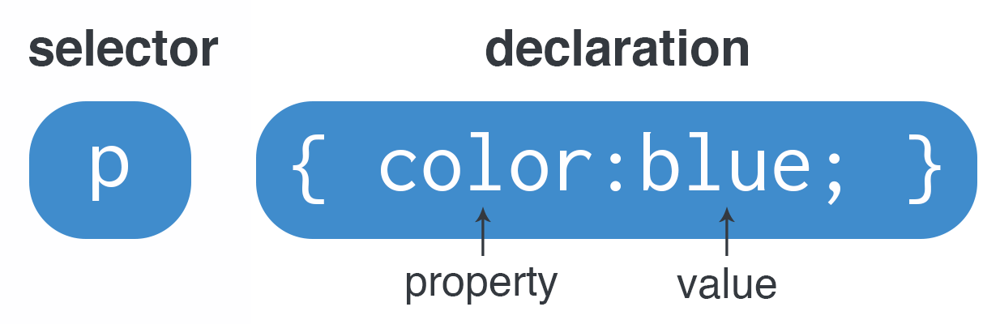
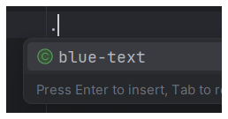
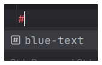

# Lesson 05 - CSS - Adding CSS

## Overview
On its own, and HTML file can be pretty plain. By adding some styles, we can both make it more aesthetically pleasing and adjust the layout. This lesson will focus on aesthetic attributes, and we will practice layout later on.

## Creating CSS Rules

No matter how you are adding your styles to a web page, the syntax for creating a rule is always the same.

The image below outlines the parts of a CSS declaration.



The selector identifies what elements the rules should apply to. In the image above, the style will be added to *all* `<p>` tags, because the selector is `p`.

The declaration block contains the style that should be applied to the elements. In the image above, only a single rule is added. However, you can add as many style rules as you would like. They must be separated by semicolons (`;`).

For each rule we add, we define a property (the part of the element we should change the style on) and a value (what the style should be changed to). The property and value are always separated by a colon (`:`). In the example above, `color` is the property that controls the color of the text, and `blue` is the new value of the text color.

All together, the above rule could be explained as "all `<p>` tags should have blue text".

## Inline CSS Styles (Bad) **(DO NOT ACTUALLY USE)**

The worst way to add a style to an HTML element is with an inline style tag. You should never use these, but they are a part of the curriculum.

An inline selector is applied in the HTML directly onto a single element using a `style` attribute. The syntax doesn't require a selector like in our example above, but otherwise is the same in regard to using properties and values.

```HTML
<p style="color: blue; font-size: 20px">This text is blue and 20 pixels tall!</p>
```

Now that you have seen how to add an inline style, never use it. Ever. I will dock marks for it. A lot of marks.

I'm serious.

NO.

INLINE.

STYLING.

## Rules in a Style Tag

A `<style>` tag can be added to the `<head>` of an HTML page to define the styles for that specific HTML document. This can be useful for small single page projects, but is not recommended for websites that have more than one page because it requires you to copy and paste your styles between documents over and over again.

```HTML
<head>
    <title>Style Tag Example</title>
    <style>
        p {
            color: blue;
            font-size: 20px;
        }
    </style>
</head>
<body>
<p>All paragraphs will have blue text and a 20 pixel font size.</p>
</body>
```

## Rules in a `.css` File

Separating your styles into a `.css` file is always a good option. It works well for single page websites, but also allows for easy scaling to larger projects. With an external `.css` file, any page of your website can be linked to it allowing them all to share the exact same style rules!

To link a `.css` file you will need to add a `<link>` tag in your `<head>`:

* The `rel` attribute tells the browser that this is a CSS file.
* The `href` attribute connects the `styles.css` file from your `css/` folder to the HTML document.

```HTML
<head>
    <title>External CSS Example</title>
    <link rel="stylesheet" href="/css/styles.css">
</head>
```

In your CSS file, you can add rules and selectors the exact same way you would in a `<style>` tag:

```CSS
p {
   color: blue;
   font-size: 20px;
}
```

## Using Selectors

So far, we have only looked at tag selectors for CSS rules, but there are other kinds of selectors as well. These are useful for when you either want to:

* Only style some elements that are a specific tag
* Style multiple elements that have different tags with the same styles.

This lesson will cover tag, class, and ID selectors. Before discussing each one, there are some important rules to understand.

1. CSS applies rules from least specific to most specific. This means that:
    * ID selectors override Class selectors and Tag selectors.
    * Class selectors override tag selectors
    * Tag selectors always get overridden.
2. CSS applies rules from top to bottom (in the `.css` file). This means that a rule at the top will be overridden by a rule with the same specificity below it.
3. Any number of elements in an HTML document can have the same class.
4. Only a single element in an HTML document can have a specific ID (for example, you can't have 2 elements with the ID "logo")

### Tag Selectors

Tag selectors select all of a specific HTML tag. There is no additional set up in the HTML document to get a tag selector to work.

In CSS, a tag selector can be used by typing just the tags characters. For example, to select all `<h1>` tags to make them blue, your rule would look like this:

```CSS
h1 {
    color: blue;
}
```

### Class Selectors

Class selectors do require setup in your HTML document.

There are a few important rules for creating a class name.

* No spaces in the class name (use `-` or `_` instead).
* Class names should be all lowercase
* Class names should be descriptive
* Class names should not start with numbers

To add a class to an HTML element, simply use the `class` attribute. Below is an example of adding a class to a `<p>` tag for changing the text to blue:

```HTML
<p class="blue-text">This text is blue!</p>
<p>This text is still black.</p>
```

With a class added to an HTML tag, you can now select that class in your CSS document. Classes are selected by typing a `.` before the class name:

```CSS
.blue-text{
    color: blue;
}
```

You will also notice in WebStorm that when you type a `.` in your editor, it will try to help you autocomplete your class names.



#### Adding Multiple Classes

Sometimes, you might want to include multiple classes on a single element. This could be useful for a number of reasons. To add multiple classes to a single element, separate them by a space:

```HTML
<p class="blue-text black-border">This text has the blue text and black border classes!</p>
```

Styles from both classes will be applied to the element. If multiple styles conflict (like setting the text color to 2 different colors), then the most recent CSS rule will be applied.

### ID Selectors

ID selectors do require setup in your HTML document.

There are a few important rules for creating an ID.

* No spaces in the ID name (use `-` or `_` instead).
* ID names should be all lowercase
* ID names should be descriptive
* ID names should not start with numbers
* You cannot have the same ID repeated multiple times.

To add an ID to an HTML element, simply use the `id` attribute. Below is an example of adding an ID to a `<p>` tag for changing the text to blue:

```HTML
<p id="blue-text">This text is blue!</p>
<p>This text is still black.</p>
```

With an ID added to an HTML tag, you can now select that ID in your CSS document. IDs are selected by typing a `#` before the ID name:

```CSS
#blue-text{
    color: blue;
}
```

You will also notice in WebStorm that when you type a `#` in your editor, it will try to help you autocomplete your ID names.



#### Adding Multiple IDs

Because there can only be one ID of a kind on any given page, usually it is easier to add a class and an ID. Don't put multiple IDs on a single element.

### IDs and Classes

An element can have both an ID and classes. IDs are considered more specific and will override any class proerties that are the same. To add an ID and a class to an HTML element, just add both attributes:

```HTML
<p id="info-text" class="blue-text black-border">This has an ID and a class.</p>
```

## The Everything Selector (`*`)

Sometimes you want to select every single element on an HTML page to apply a style to. Usually this is used to reset default browser styling. The `*` symbol is the universal selector and selects everything.

This example will change all text to blue.
```CSS
* {
   color: blue;
}
```

## Resetting Browser Default Styles

One last thing to consider for adding CSS styles is that HTML and CSS have been around for a LONG time. In the past, browsers were set up to render HTML pages with specific defaults that are no longer compatible with modern web development expectations. However, updating these browser defaults would break older websites. Because of this, there are some styles that are recommended to be added to all projects you work on.

These styles do a couple of important things.

1. They keep images from expanding outside of the page or container you put them in.
2. They keep borders and margins from expanding past the horizontal edge of the page.

```CSS
* {
    box-sizing: border-box;
    margin: 0;
}

img {
    max-width: 100%;
}
```

## How to Add Your Own CSS Rules

*Before starting, use the `Challenge 03 - CSS Files` folder to create a root folder structure identical to the root folder below:*

```
Challenge 03 - CSS Files/
├── index.html
├── pages/
├── images/
├── css/
│   └── styles.css
└── scripts/
    └── script.js
```

### 1. Add Some Filler Content To Your HTML File
### 2. Add an inline style
### 3. Delete the inline style
### 4. Add a style tag
### 5. Use some tag selectors to add styles in your style tag
### 6. Add some class attributes to multiple HTML elements
### 7. Style those classes in your style tag
### 8. Add an ID attribute to something
### 9. Style the ID attribute
### 10. Copy the contents of your style tag to your styles.css file.
### 11. Delete your style tag
### 12. Link your styles

When creating a website for real, typically you will just jump straight to editing the styles.css folder, the purpose of these steps was to practice both CSS files and style tags.