# Lesson 06 - CSS - Box Model

## Overview

The box model is fundamental to understanding how to create custom web layouts.

A great place to start learning about the CSS Box Model is with this [video here by Kevin Powell](https://www.youtube.com/watch?v=D_akuQHIPtg).


## Everything is Boxes

In an HTML document, every single element is considered a box. But boxes are like ogres (or onions) they have layers. 

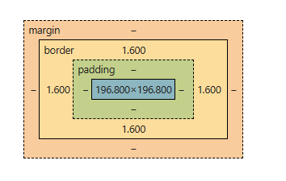

These layers determine how elements are laid out in relation to one another.

You can always check an elements box model by inspecting the page and selecting that element, as seen below:


## Layers of The Box Model

Each layer represents a different part of the element. Below will outline how much space each layer takes up, and how to check.

### Content

Content is the size of the actual *content* of the HTML element. It is the height and width of any given text or image.

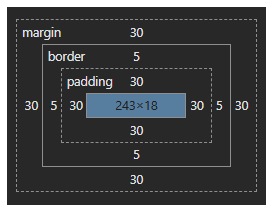

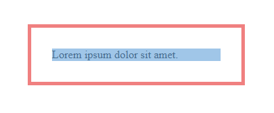

### Padding

The padding is the space between the content and the border.

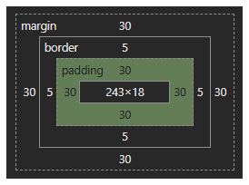

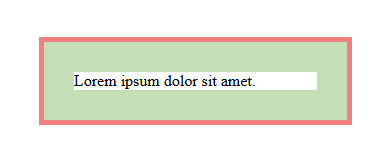

### Border

The border is a visible border that can be added around an element. By default, elements do not have borders and the size is 0.

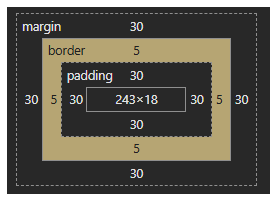

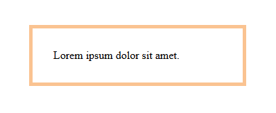

### Margin

The margin is the space between the element's border and other elements' borders.

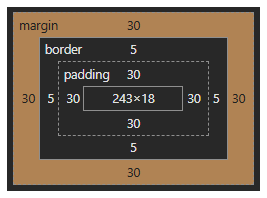

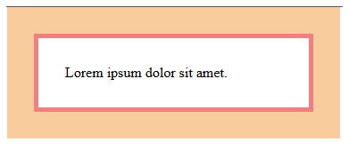

Margins will overlap with one another, as seen below:

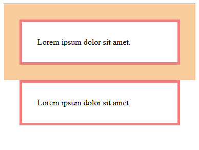

## Box Sizing

When you set an elements width and height, by default you are setting the content box size:

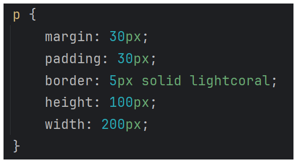

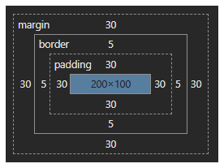

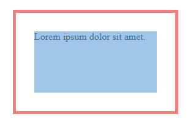

This can feel unintuitive, so we typically set our `box-sizing` property on all elements to `border-box`. 

```CSS
* {
    box-sizing: border-box;
}
```

This makes it so when we set our height and width, it is applied to the total height and width of the content, padding, and border combined:


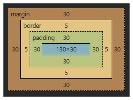

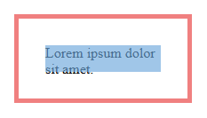

For a side by side comparison:

| Content Box Sizing                                             | Border Box Sizing                                               |
|----------------------------------------------------------------|-----------------------------------------------------------------|
|      |      |
|  |  |
