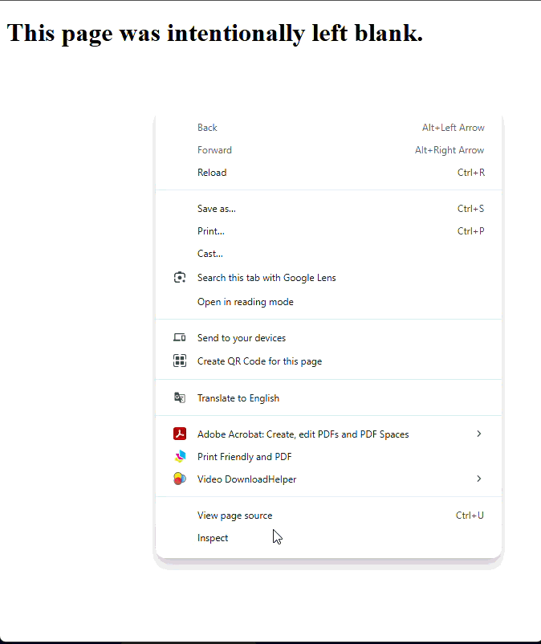

# Lesson 09 - JS - Adding JavaScript to Websites

## Overview

JavaScript is the scripting language of the Web. It can be used to create websites that are more interactive. JavaScript has some similarities to Python, but structurally there are some important differences. This lesson is intended to walk you through how to add JavaScript to a website and some basic structures that you have already learned about in Python.

## Adding With a Script Tag

For small single page websites, it is appropriate to create a `<script>` tag to enclose your JavaScript. `<script>` tags are typically placed either at the bottom of the body (to ensure the entire website has loaded) or in the `<head>` to keep them out of the way. 

This is an example of what it might look like to add a "Hello World!" script to a blank HTML document with JavaScript:

*index.html*
```html
<!DOCTYPE html>
<html lang="en">
<head>
    <meta charset="UTF-8">
    <title>Hello World</title>
    <script>
        console.log("Hello World!");
    </script>
</head>
<body>
</body>
</html>
```

When using `<script>` tags like this, all of your JavaScript is added directly into the HTML.

## Adding With an External File

More commonly, you will include scripts that are external files. This is similar to linking a `.css` file, but instead of using a `<link>` tag, a `<script>` tag is still used. The `src` attribute is used to link the relative path. 

Below is an example of what a "Hello World" script might look like in an external file:

*index.html*
```html
<!DOCTYPE html>
<html lang="en">
<head>
    <meta charset="UTF-8">
    <title>Hello World</title>
    <script src="scripts/script.js"></script>
</head>
<body>
</body>
</html>
```

*script.js*
```js
console.log("Hello World!");
```

## JavaScript Syntax and Rules

This next section will outline some key differences between Python and JavaScript to help you create effective scripts based on what you already understand about programming.

### Accessing the Console

In Python, we see printed messages through the terminal. In JavaScript, we instead use the console, which can be found when inspecting a website.



Instead of using `print()` JavaScript uses `console.log()`:

```js
console.log("Hello World!");
```

JavaScript doesn't have formatted strings, and instead uses template literals. These can be used similar to Python formatted strings when you need to send information tothe debugger that includes a string and another value.

Template literals use `` ` `` instead of `'` or `"` to wrap their strings, and then insert values with `${}`. Like this:

```js
let number = 7000;

console.log(`My favourite number is ${number}`);
```

### Declaring Variables and Constants

To declare a variable in JavaScript, we use the `let` keyword before giving the variable a name:

```js
let number = 0;
```

Additionally, variable names are in `camelCase` which means that there are no spaces or underscores, and words are instead separated by capital letters (after the first word):

```js
let myNumber = 0;
```

Constants are declared with the `const` keyword:

```js
const MY_NUMBER = 0;
```

Hard coded numbers and values that do not change (like the example above) use `UPPER_SNAKE_CASE`.

Values that are calculated once at runtime still use `camelCase`:

```js
let number = 10;

const myNumber = number + 10;
```

One other very important difference with JavaScript is that there is a much stricter locak scope. In Python, a variable could be created anywhere and used anywhere. In JavaScript, a variable can **only be used in the scope it is declared**. 

This means that if a variable is declared inside of a function, if statement, or loop then **it can only be used inside of that function, if statement, or loop.**

### If Statements

In JavaScript, an if statement has the following syntax:

```js
let number = 18;

if (number >= 10) {
    console.log("The number is big!");
}
```

JavaScript else if syntax looks like this:

```js
let number = 8;

if (number >= 10) {
    console.log("The number is big!");
} else {
    console.log("The number is small!");
}
```

And finally the if / else if / else syntax looks like this in JavaScript:
```js
let number = -8;

if (number >= 10) {
    console.log("The number is big!");
} else if (number < 0){
    console.log("The number is negative");
} else {
    console.log("The number is small!");
}
```

#### Logical Keywords in JavaScript

JavaScript also doesn't have the same `and`, `or`, or `not` keywords we have in Python. 

Instead of `and` JavaScript uses `&&`:

```js
let number = 8;
let otherNumber = 20;

if (number >= 10 && otherNumber >= 10){
    console.log("Both numbers are big");
}
```

Instead of `or` JavaScript uses `||`:

```js
let number = 8;
let otherNumber = 20;

if (number >= 10 || otherNumber >= 10){
    console.log("At least one number is big");
}
```

Instead of `not` JavaScript uses `!`:
```js
let myBoolean = false;

if (myBoolean){
    console.log("This code will not run because boolean is false");
}

if (!myBoolean){
    console.log("This code will run because of the '!'");
}
```

### For Loops

In JavaScript, a for loop always needs all 3 of the following included when it's created:

* Initialization (the number to start counting from)
* Condition (the number to stop at)
* Increment (the number to count up by)

The general structure looks like this:

```js
for (initialization; condition; increment){
    // Loop this section of code
}
```

If we added some real values to run a loop 10 times, it could look like this:

```js
for (let i = 0; i < 10; i++){
    console.log(i);
}
```

Some important notes:

* The variable needs to be properly initialized with the `let` keyword.
* Each section is separated with `;`.
* `i++` is shorthand for `i += 1` or `i = i + 1`.

### While Loops

JavaScript While loops are very similar to Python while loops. Just like Python, a while loop continues to run until the condition is false:

```js
let value = 0;

while (value < 10) {
    value++;
    console.log(value);
}
```

### Declaring Functions

Declaring a function in JavaScript follows many of the same rules as it does in Python, with a few small changes:

```js
// Declaring the function
function greet(){
    console.log("Hello World");
}

// Invoking the function
greet();
```

Just like Python, JavaScript also allows you to pass parameters to a function:

```js
function green(name){
    console.log(`Hello ${name}`);
}
```

JavaScript also has "hoisting" which means that functions can be called before they are declared in the code. Function declarations are "hoisted" to the top.

That means that even though this would result in a `NameError` in Python:

```python
greet()

def greet():
    print("Hello world!")
```

In JavaScript this is totally fine:

```js
greet();

function greet(){
    console.log("Hello World!");
}
```

It is a very common practice in JavaScript to place all function declarations at the bottom of your code.
